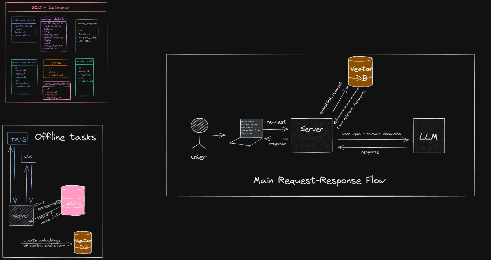
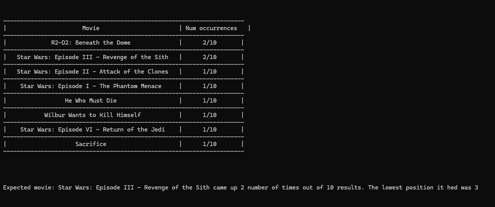
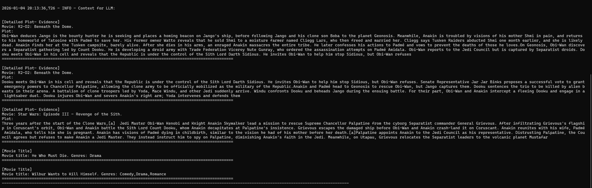

# ?? CineRecall

CineRecall is a Retrieval-Augmented Generation (RAG) system designed to identify movies from fuzzy, incomplete, or imperfect plot memories.

_"I remember a movie where a robbery goes wrong" British gangsters" lots of chaos."_

CineRecall helps you find that movie.

_CineRecall is built as a learning-focused, retrieval-first GenAI system rather than a consumer-facing product._

---

🌐 Live Demo

[CineRecall]()

---

## ?? Demo


---

## 📋 Table of Contents

- [Problem Statement](#problem-statement)
- [What CineRecall Does](#what-cinerecall-does)
- [System Architecture](#️system-architecture)
- [Data & Offline Ingestion](#️data--offline-ingestion)
- [Retrieval Design (Core of the Project)](#retrieval-design-core-of-the-project)
- [Embeddings Strategy](#embeddings-strategy)
- [Retrieval Evaluation & Analytics](#retrieval-evaluation--analytics)
- [LLM Context Transparency](#llm-context-transparency)
- [LLM Prompting Strategy](#llm-prompting-strategy)
- [Rate Limiting & Cost Controls](#️rate-limiting--cost-controls)
- [Tech Stack](#tech-stack)
- [Project Phases](#project-phases)
- [Data & Database Availability](#data--database-availability)
- [Required Setup (Before Running the App)](#required-setup-before-running-the-app)
- [Limitations & Trade-offs](#️limitations--trade-offs)
- [How to Run Locally](#how-to-run-locally)
- [Example Queries](#example-queries)
- [What I Learned Building This](#what-i-learned-building-this)
- [Acknowledgements](#acknowledgements)

---

## ❓ Problem Statement

People often remember fragments of a movie:

- parts of the plot
- a scene
- a vague theme
- or a feeling

Traditional keyword search fails because:

- memory is imprecise
- wording is inconsistent
- relevant information is spread across plot, title, tagline, and metadata
- CineRecall solves this using semantic retrieval + controlled LLM reasoning.

---

## 🧠 What CineRecall Does

1. Accepts a natural language, fuzzy movie description
2. Retrieves semantically relevant movie evidence from a vector database
3. Builds a transparent, auditable context for the LLM
4. Asks the LLM to identify the movie using evidence only
5. Returns:

- movie title
- explanation
- confidence score

---

## 🗺️ System Architecture



### High-level flow:

- #### Offline pipeline

  - Collect movie data from TMDB & Wikipedia
  - Store structured data in SQLite
  - Generate embeddings and store in ChromaDB

- #### Online pipeline
  - User query → embedding
  - Vector search → top-K relevant chunks
  - Evidence-based prompt → LLM
  - Structured JSON output

---

## 🗄️ Data & Offline Ingestion

### Data Sources

- MovieLens
- TMDB
- Wikipedia

### Storage

- SQLite: structured movie metadata
- ChromaDB: semantic vector storage

Offline ingestion ensures:

- reproducibility
- controlled experimentation
- no runtime scraping

---

## 🔍 Retrieval Design (Core of the Project)

Retrieval quality is the most critical component of CineRecall.

### Key Design Choices:

- Centralized vector store
- Metadata not embedded blindly
- Separate document types:
  - Title
  - Tagline
  - Short plot
  - Detailed plot

Each serves a different retrieval purpose.

---

## 🧬 Embeddings Strategy

### Embedding Model

- BAAI/bge-base-en-v1.5

### Why BGE?

- Near-API-level performance
- No runtime costs
- Privacy (local execution)
- Optimized for retrieval tasks

---

## 📊 Retrieval Evaluation & Analytics

To validate retrieval quality, I built a custom benchmark:

- For each query:
  - retrieve top-K results
  - count how often the expected movie appears
  - track lowest rank position



This allowed:

- empirical comparison of chunking strategies
- detection of metadata pollution
- validation before LLM integration

---

## 🧾 LLM Context Transparency

CineRecall does not hide context from the LLM.

Each prompt contains:

- clearly labeled evidence blocks
- movie attribution for every excerpt
- strict instructions to avoid hallucination



---

## 🤖 LLM Prompting Strategy

- LLM used: OpenAI GPT-4o-mini
- Role: evidence evaluator, not knowledge oracle
- Must:
  - use only provided context
  - return valid JSON
  - provide confidence score

## ⏱️ Rate Limiting & Cost Controls

This is a personal / portfolio project.

To manage API costs:

- Requests are rate-limited (1-minute cooldown)
- Prevents accidental repeated LLM calls

This is a **_deliberate engineering trade-off_**, not a limitation.

---

## 🧰 Tech Stack

- Python
- LangChain
- ChromaDB
- SQLite
- HuggingFace Transformers
- OpenAI GPT-4o-mini
- Streamlit

---

## 🧭 Project Phases

**Phase 1: Baseline** : _Current Stage_

- ✅ End-to-end RAG

- ✅ Clean document representation

- ✅ Retrieval evaluation

**Phase 2: Retrieval Optimization**

- Chunking & embedding experiments
- MMR / hybrid search evaluation

**Phase 3 "Adaptive Generation**

- Ask clarifying questions on low confidence

**Phase 4 "Extensions (Optional)**

- Streaming links
- Recommendation layer

---

## 📁 Data & Database Availability

**_CineRecall does not ship with pre-populated databases._**

For legal, size, and reproducibility reasons, neither the SQLite database nor the Chroma vector store are included in this repository.

Why?

- Movie plot data is sourced from TMDB and Wikipedia
- Vector databases can be large and non-portable
- Embeddings should be reproducible, not committed artifacts
- This mirrors real-world ML systems, where databases are environment-specific

### 🗄️ Databases Used

#### 1️⃣ SQLite (Structured Metadata)

SQLite is used to store:

- movie metadata
- titles and alternate titles
- genres
- cast & crew
- plot variants (short / detailed)

📌 Status:

❌ Not included in the repo

✅ Created via the offline ingestion pipeline

#### 2️⃣ ChromaDB (Vector Store)

ChromaDB stores:

- embeddings for movie documents
- chunked detailed plots
- atomic title / tagline / short plot documents

📌 Status:

❌ Not included in the repo

✅ Generated locally after embeddings are created

---

## 🧱 Required Setup (Before Running the App)

Before launching the Streamlit app, users must:

1. Run the offline ingestion pipeline

- Fetch data from TMDB & Wikipedia
- Store structured data in SQLite
- Generate embeddings
- Populate ChromaDB

2. Verify database paths

- SQLite path
- Chroma persist directory

Only after this step is complete can CineRecall run end-to-end.

### ⚙️ Offline Ingestion Pipeline (Required)

TMDB / Wikipedia -> Data Cleaning -> SQLite DB -> Embedding Generation -> ChromaDB

This separation ensures:

- clean experimentation
- controlled retrieval evaluation
- no hidden runtime dependencies

---

## ⚠️ Limitations & Trade-offs

- Not optimized for latency
- Focused on correctness over recall
- Small LLM context window by design
- Retrieval quality prioritized over model size
- All trade-offs are explicit and intentional.

---

## 🚀 How to Run Locally

⚠️ Prerequisite:
This project requires running the offline ingestion pipeline
to generate both the SQLite database and the Chroma vector store.
The app will not function without them.

- Step 1: Clone and Install Dependencies

```
git clone https://github.com/prnk04/cinerecall.git
cd cinerecall
python -m venv cineRecall_env
source cineRecall_env/bin/activate # or Scripts\activate on Windows
pip install -r requirements.txt
```

- Step 2: Download datasets and get the API keys

  - [Download](https://grouplens.org/datasets/movielens/latest/) the MovieLens dataset
  - **TMDB API**: Sign up at https://www.themoviedb.org/settings/api
  - **OpenAI API**: Get key from https://platform.openai.com/api-keys

- Step 3: create .env file

```
# Required for data fetching
TMDB_API_READ_ACCESS_TOKEN = <your_tmdb_access_token>
TMDB_BASE_URL=https://api.themoviedb.org/3/movie/
WIKI_URL=https://en.wikipedia.org/api/rest_v1/page/html/
INDEX_FILE_PATH=<path_to_file>
TITLES_FILE_PATH=<path_to_file>
MOVIE_DETAILS_FILE=<path_to_file_to_keep_merged_csvs_with_data_for_movie>
SEMAPHORE_CONCURRENCY=5
SQLITE_DB_PATH=<your_sqlite_db_path>

# required for embedding, and retrieval
HUGGINGFACE_EMBEDDING_MODEL=BAAI/bge-base-en-v1.5
CHROMA_MOVIES_COLLECTION=<your_chroma_collection_name>
CHROMA_DIR=<your_chroma_persist_dir_path>
CHROMA_DB_VERSION=v0
LAST_EMBEDDED_ID=0

# required for LLM
OPENAI_API_KEY=<your_open_ai_key>
```

- Step 4: Create the database to store the movies details and to create the tables, run the commands in file 'createTables.sql'

**_TL;DR: Fetch data → build SQLite → generate embeddings → start app._**

- Step 5: Run the preprocessing(fetch data from Wikipedia and TMDB and store them in db):

```
python -m src.data_fetching.fetch_movie_data
```

- This will

  - load the data from the MovieLens dataset files
  - create a new file that will have the merged data
  - use this data to call TMDB and Wiki API to get movie details
  - store these details in the SQLite db

- Step 6: Data Ingestion: Use the movie data store in SQLite db to create embeddings, and store them in vector db

```
python -m src.ingestion.data_ingestion
```

- This will

  - Iteratively fetch movies from db
  - turn them into LangChain Documents
  - create chunks from these Documents
  - embed these chunks
  - store these embeddings in vector db

- Step 7: Start the UI:

```
streamlit run app.py
```

---

## 💬 Example Queries:

- A movie where a teenager accidentally travels back in time and interferes with his parents' first meeting.
- An adventure movie about pirates, a cursed crew, and a ship that appears at night
- movie where obi-wan sacrifices himself
- movie about a heist gone wrong involving british gangsters

---

## 📚 What I Learned Building This

This project taught me:

### 1. Retrieval is 80% of RAG Quality

The best LLM can't fix bad retrieval. I spent most of my time on:

- Chunk size optimization (tested 200, 500, 700, 1200 tokens)
- Metadata enrichment (adding actors to embedded text improved actor-based queries by 25%)

### 2. Evaluation Before LLM Integration

I built retrieval evaluation **before** adding the LLM because:

- LLM calls cost money; retrieval testing is free
- Fixing retrieval bugs after LLM integration is much harder
- You need ground truth to know if the system works

### 3. Embeddings Model Choice Matters

Upgrading from MiniLM → BGE improved Hit@1 by 14% with zero code changes.
Key lesson: **model selection is a high-leverage decision**.

### 4. Design Trade-offs are Explicit

Every decision has costs:

- Smaller chunks → better precision, worse context
- Larger context → better LLM reasoning, higher costs
- Local embeddings → no runtime cost, slower than API
- I documented every trade-off and tested alternatives.

## 🙏 Acknowledgements

Hands-On RAG for Production Ofer Mendelevitch & Forrest Bao

LangChain "RAG from Scratch Lance Martin

ChatGPT & Claude debugging partners
