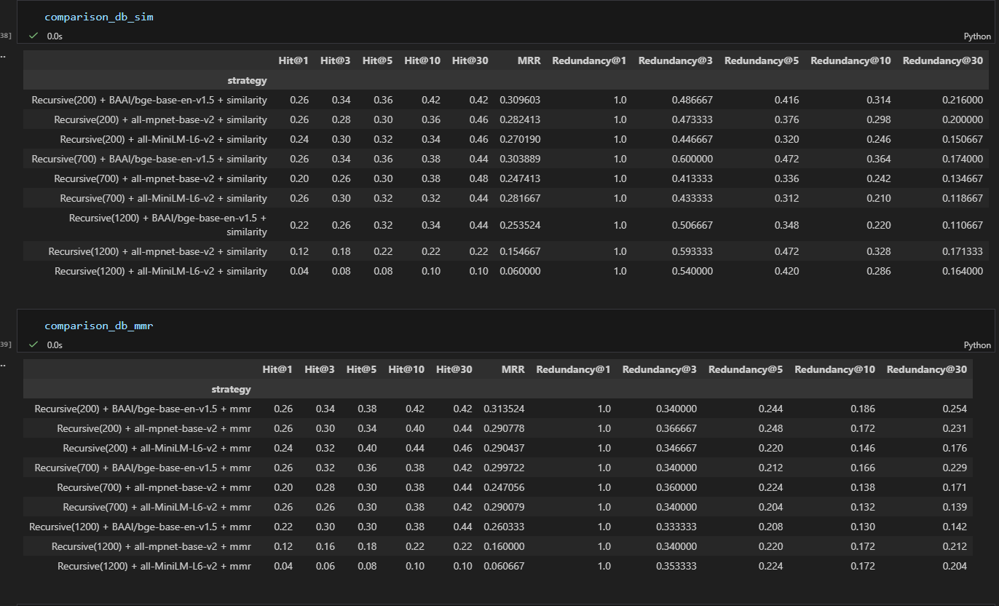

# 🎬 CineRecall

_A Retrieval-First RAG System for Movie Recall from Fuzzy Memory_

CineRecall helps users identify movies based on imprecise, partial, or fuzzy plot descriptions.
Instead of relying on the LLM alone, CineRecall emphasizes retrieval quality, evidence diversity, and empirical evaluation across chunking, embedding, and search strategies.

_"I remember a movie where a robbery goes wrong — British gangsters, lots of chaos."_

---

🌐 Live Demo

[CineRecall](https://cinerecall.streamlit.app/)

---

## 🎥 Demo


---

## 📋 Table of Contents

- [Problem Statement](#-problem-statement)
- [What CineRecall Does](#-what-cinerecall-does)
- [Why CineRecall Is Different](#-why-cinerecall-is-different)
- [System Architecture](#️-system-architecture)
- [Data & Storage](#-data--storage)
- [Chunking Strategy](#-chunking-strategy)
- [Embeddings Strategy](#-embeddings-strategy)
- [Retrieval Design (Core of the Project)](#-retrieval-design-core-of-the-project)
- [Retrieval Evaluation & Analytics](#-retrieval-evaluation--analytics)
- [LLM Context Transparency](#-llm-context-transparency)
- [LLM Prompting Strategy](#-llm-prompting-strategy)
- [Rate Limiting & Cost Controls](#️-rate-limiting--cost-controls)
- [Tech Stack](#-tech-stack)
- [Project Phases](#-project-phases)
- [Running the Project](#️-running-the-project)
- [Example Queries](#-example-queries)
- [Limitations & Trade-offs](#️-limitations--trade-offs)
- [What I Learned Building This](#-what-i-learned-building-this)
- [Acknowledgements](#-acknowledgements)

---

## ❓ Problem Statement

People often remember fragments of a movie:

- parts of the plot
- a scene
- a vague theme
- or a feeling

Traditional keyword search fails because:

- memory is imprecise
- wording is inconsistent
- relevant information is spread across plot, title, tagline, and metadata

CineRecall solves this using semantic retrieval + controlled LLM reasoning.

---

## 🧠 What CineRecall Does

1. Accepts a natural language, fuzzy movie description
2. Retrieves semantically relevant movie evidence from a vector database
3. Builds a transparent, auditable context for the LLM
4. Asks the LLM to identify the movie using evidence only
5. Returns:

- movie title
- explanation

---

## ⭐ Why CineRecall Is Different

Most RAG demos focus on the LLM.
CineRecall focuses on **retrieval quality, evidence diversity, and evaluation**.

Key differentiators:

- Retrieval-first design
- Empirical comparison of chunking + embeddings + search strategies
- Custom redundancy metrics for LLM context quality
- Transparent, auditable LLM prompts

---

## 🗺️ System Architecture


### High-level flow:

- #### Offline pipeline

  - Collect movie data from TMDB & Wikipedia
  - Store structured data in SQLite
  - Chunk the documents
  - Generate embeddings and store in ChromaDB

- #### Online pipeline
  - User query → embedding
  - Vector search → top-K relevant chunks
  - Evidence-based prompt → LLM
  - Final movie prediction with explanation & confidence

---

## 📁 Data & Storage

#### SQLite (Relational Store)

SQLite is used to store:

- movie metadata
- titles and alternate titles
- genres
- cast & crew
- plot variants (short / detailed)

⚠️ Note: SQLite database is **not included** in the repository. Created via the offline ingestion pipeline

#### ChromaDB (Vector Store)

- ChromaDB stores:
  - embeddings for movie documents
  - chunked detailed plots
  - atomic title / tagline / short plot documents
- Persisted locally using `persist_directory`
- Automatically rebuilt if missing

⚠️ Note: The Chroma DB is **not included** in the repository
Users must generate embeddings locally(demo mode supported).

**_CineRecall does not ship with pre-populated databases._**

---

## 🧩 Chunking Strategy

CineRecall evaluates multiple **recursive chunking strategies**

- Chunk sizes: **200 / 700 / 1200 tokens**
- Overlap-aware recursive splitting
- Chunk types tracked via metadata(plot type, source)

Chunking is treated as a **first-class hyperparameter**, not a fixed choice.

---

## 🧬 Embeddings Strategy

The following embedding models were empirically compared:

- BAAI/bge-base-en-v1.5
- all-mpnet-base-v2
- all-MiniLM-L6-v2

Each model was evaluated across multiple chunk sizes and retrieval strategies.

### Embedding Model Selected

- BAAI/bge-base-en-v1.5

### Why BGE?

- Performed the best during evaluation
- Near-API-level performance
- No runtime costs
- Privacy (local execution)
- Optimized for retrieval tasks

---

## 🔍 Retrieval Design (Core of the Project)

Retrieval quality is the most critical component of CineRecall.

### Key Design Choices:

- Centralized vector store
- Metadata not embedded blindly
- Separate document types:
  - Title
  - Tagline
  - Short plot
  - Detailed plot

Each serves a different retrieval purpose.

Two retrieval approaches were benchmarked:

- **Similarity Search**

  - Pure cosine similarity
  - Optimizes raw relevance
  - Higher redundancy risk

- **Max Marginal Relevance(MMR)**
  - Balances relevance and diversity
  - Reduces duplicate chunks from the same movie
  - Produces cleaner LLM context

⚠️ Note on MMR:
MMR reduces redundancy at the movie level but may still return
multiple chunks from the same document if chunk granularity is high.

**Final Choice**: Max Marginal Relevance

---

## 📊 Retrieval Evaluation & Analytics

CineRecall includes a custom retrieval benchmark designed specifically for fuzzy recall tasks.

**Dataset**

- ~3000 movies
- Multiple plot variants per movie
- Tested with User queries written as **fuzzy memory descriptions** for 50 movies

**Metrics Used**

| Metric                    | Description                                                  |
| ------------------------- | ------------------------------------------------------------ |
| Hit@N                     | Fraction of queries where the correct movie appears in top-N |
| MRR(Mean Reciprocal Rank) | Rewards earlier correct retrieval                            |
| Redundancy@N              | Measures dominance of the most frequent movie in top-N       |

### 📈 Evaluation Results (Summary)

**Similarity Search**
Key observations:

- Best performance with **Recursive(200-700) chunks**
- `BAAI/bge-base-en-v1.5` consistently outperforms other embeddings
- Larger chunk sizes degrade recall significantly

**MMR Search**

Key observations:

- Slight recall tradeoff v spure similarity
- **Significant reduction in redundancy**
- More diverse and informative LLM context

🔎**Key Insight**

> Bottom line: Smaller chunks (200–700), BGE embeddings, and MMR retrieval produced the best balance of recall and evidence diversity for fuzzy recall queries.



---

## 🧾 LLM Context Transparency

CineRecall does not hide context from the LLM.

Each prompt contains:

- clearly labeled evidence blocks
- movie attribution for every excerpt
- strict instructions to avoid hallucination


---

## 🤖 LLM Prompting Strategy

- LLM used: OpenAI GPT-4o-mini
- Role: evidence evaluator, not knowledge oracle
- Only the **top, diverse evidence** is sent to the LLM
- Must:
  - use only provided context
  - return valid JSON
  - provide confidence score

## ⏱️ Rate Limiting & Cost Controls

This is a personal / portfolio project.

To manage API costs:

- Requests are rate-limited (1-minute cooldown)
- Prevents accidental repeated LLM calls

This is a **_deliberate engineering trade-off_**, not a limitation.

---

## 🧰 Tech Stack

- Python
- LangChain
- ChromaDB
- SQLite
- HuggingFace Transformers
- OpenAI GPT-4o-mini
- Streamlit

---

## 🧭 Project Phases

**Phase 1: Baseline** : _Current Stage_

- ✅ End-to-end RAG

- ✅ Clean document representation

- ✅ Retrieval evaluation

**Phase 2: Retrieval Optimization**

- OpenAI embedding comparison
- Query rewriting & intent classification
- Hybrid MB25 + vector retrieval
- NER-based reranking

**Phase 3: Adaptive Generation**

- Ask clarifying questions on low confidence

**Phase 4: Extensions (Optional)**

- Streaming links
- Recommendation layer

---

## ⚙️ Running the Project

### Modes

- **Demo mode**(default): loads sample processed documents
- **Custom mode**: user plug in their own data pipelines

- Step 1: Clone and Install Dependencies

```
git clone https://github.com/prnk04/cinerecall.git
cd cinerecall
python -m venv cineRecall_env
source cineRecall_env/bin/activate # or Scripts\activate on Windows
pip install -r requirements.txt
```

#### **For demo mode**:

- Step 2: create .env file

.env

```
APP_MODE=demo
DEMO_DOCS=data/processed/demo_chunks.json
CHROMA_DIR_DEMO=data/chroma_demo/v0
```

- Step 3: Run the data ingestion code:

```
python -m src.ingestion.data_ingestion
```

- Step 4: Launch the UI:

```
streamlit run app.py
```

#### **For custom mode**:

- Step 2: Download datasets and get the API keys

  - [Download](https://grouplens.org/datasets/movielens/latest/) the MovieLens dataset
  - **TMDB API**: Sign up at https://www.themoviedb.org/settings/api
  - **OpenAI API**: Get key from https://platform.openai.com/api-keys

- Step 3: create .env file

```
...
APP_MODE=custom
TMDB_API_READ_ACCESS_TOKEN = <your_tmdb_access_token>
INDEX_FILE_PATH=<path_to_file>
TITLES_FILE_PATH=<path_to_file>
MOVIE_DETAILS_FILE=<path_to_file_to_keep_merged_csvs_with_data_for_movie>
SQLITE_DB_PATH=<your_sqlite_db_path>
```

_Full .env sample file is provided as .env.example_

- Step 4: Create the database to store the movies details and to create the tables, run the commands in file 'createTables.sql'

**_TL;DR: Fetch data → build SQLite → generate embeddings → start app._**

- Step 5: Run the preprocessing(fetch data from Wikipedia and TMDB and store them in db):

```
python -m src.data_fetching.fetch_movie_data
```

- This will

  - load the data from the MovieLens dataset files
  - create a new file that will have the merged data
  - use this data to call TMDB and Wiki API to get movie details
  - store these details in the SQLite db

- Step 6: Data Ingestion: Use the movie data store in SQLite db to create embeddings, and store them in vector db

```
python -m src.ingestion.data_ingestion
```

- This will

  - Iteratively fetch movies from db
  - turn them into LangChain Documents
  - create chunks from these Documents
  - embed these chunks
  - store these embeddings in vector db

- Step 7: Start the UI:

```
streamlit run app.py
```

---

## 💬 Example Queries:

- A teenager and an old scientist travel through time in a car, something goes wrong and they need lightning to fix it
- A group of toys secretly come to life when humans aren't around. The main toy feels jealous when a new toy becomes the favorite, and they get lost while trying to return home.
- A musician and an aspiring actress fall in love while chasing their dreams in a big city, but their careers slowly pull them in different directions.
- Spy movie, involves poker, casino, lots of fancy places
- Woman runs away from her home and frames her husband for her allegged murder

---

## ⚠️ Limitations & Trade-offs

- Not optimized for latency
- Small LLM context window by design
- Retrieval quality prioritized over model size
- All trade-offs are explicit and intentional.

---

## 📚 What I Learned Building This

Key engineering lessons from building CineRecall:

### 1. Retrieval is 80% of RAG Quality

The best LLM can't fix bad retrieval. I spent most of my time on:

- Chunk size optimization (tested 200, 700, 1200 tokens)
- Metadata enrichment (adding actors to embedded text improved actor-based queries by 25%)

### 2. Evaluation Before LLM Integration

I built retrieval evaluation **before** adding the LLM because:

- LLM calls cost money; retrieval testing is free
- Fixing retrieval bugs after LLM integration is much harder
- You need ground truth to know if the system works

### 3. Embeddings Model Choice Matters

Upgrading from MiniLM → BGE improved Hit@1 by 8% with zero code changes.
Key lesson: **model selection is a high-leverage decision**.

### 4. Design Trade-offs are Explicit

Every decision has costs:

- Smaller chunks → better precision, worse context
- Larger context → better LLM reasoning, higher costs
- Local embeddings → no runtime cost, slower than API
- I documented every trade-off and tested alternatives.

### 5. RAG Is a Systems Problem

RAG quality depends on:

- data modeling
- chunking
- retrieval
- evaluation
- prompting

Optimizing only the LLM is insufficient.

## 🙏 Acknowledgements

Hands-On RAG for Production Ofer Mendelevitch & Forrest Bao

LangChain "RAG from Scratch Lance Martin

ChatGPT & Claude debugging partners
